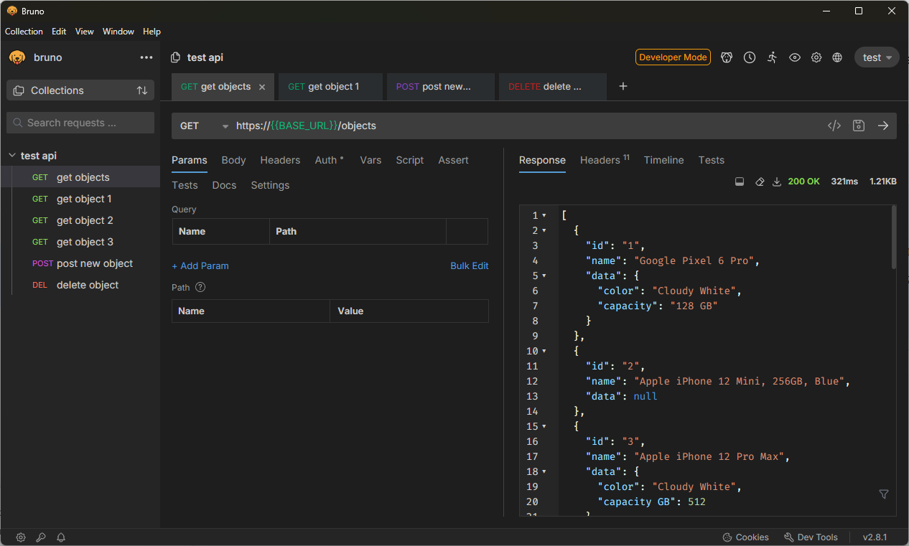
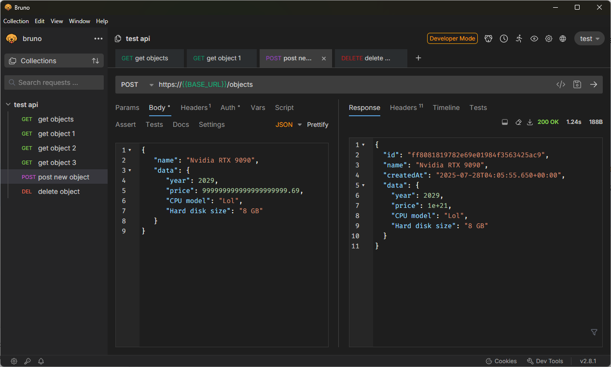
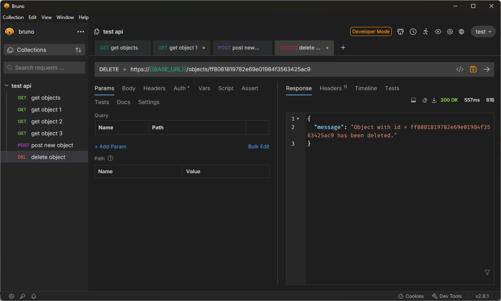
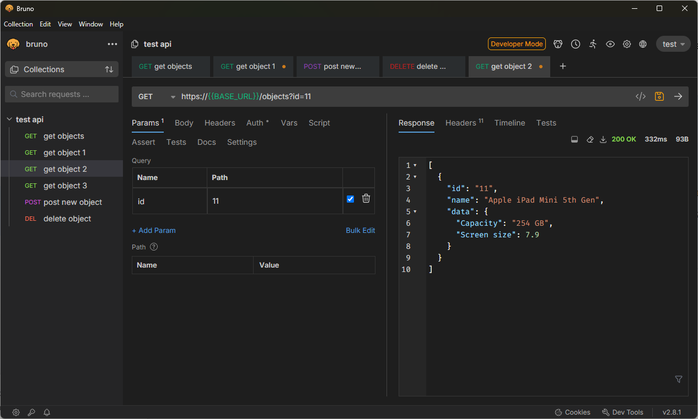
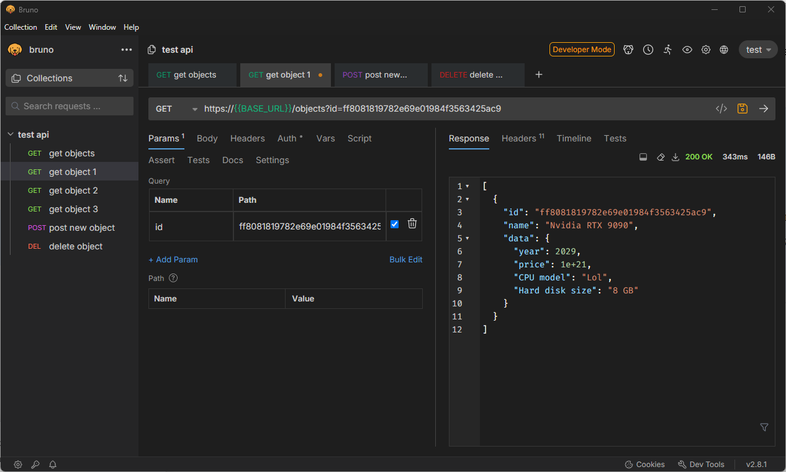
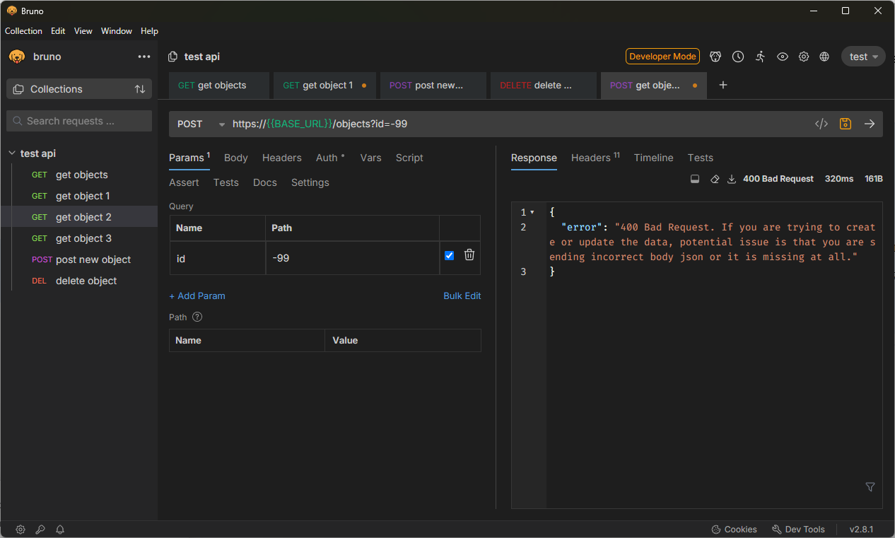

# Project Part 2 Postman Boogaloo

## Part 1

### Clients

Clients initiate communication by sending requests to servers to fetch or manipulate resources. Typically this your computer, an app, or a querying program of somekind.  

### Servers

Servers listen for incoming connections on the address/port combo and respond to them. Typically after doing a database query, or some other logic. This is usually a webserver, or just somebody else's computer that is accepting connections.   

### Requests

A client’s message to the server describing what action to perform.  Consists of:

- **Request details**: method, URL (path + query), and protocol version.  
- **Headers**: metadata like `Host`, `User-Agent`, `Accept`.  
- **Body**: optional payload of data to be sent. Only certain methods are supposed to have this (POST, PUT)  

### Responses

A server’s reply to a client’s request. Consists of:

- **Status details**: protocol version, status code, and response code (HTTP/1.1 200 OK).  
- **Headers**: metadata like `Content-Type`, `Content-Length`, `Set-Cookie`.
- **Body**: optional payload containing the requested resource. Or sometimes a JSON with an error message despite the response code being 200 OK because some people like to live dangerously  

### Headers vs. Body

Headers are metadata and are just their to give the client and server some clues about what should be sent back, who the client/server is, really they can be just about anything you can encode as plain text. Whereas the body is the actual data the client (or server) cares about (if they so happen to be expecting a body) this really can be ANYTHING. Anything at all. But typically its JSON, HTML, XML, or some binary payload.

### Status Codes

Numbers that describe the result of a request:

| Range | Category            |
|------------|-------------|
| 100–199    | Informational       |
| 200–299    | Success             |
| 300–399    | Redirection         |
| 400–499    | Client Error (Your problem)       |
| 500–599    | Server Error (Our problem)       |

Examples:
- 200 OK 
- 404 Not Found   
- 417 I'm a teapot
- 420 Enhance your calm
- 500 Internal Server Error 

### HTTP Verbs

Describe the intended action on a resource:

- GET: get me some info.  
- POST: take this info and create something with it.  
- PUT: replace or update a resource with this info I am giving you.  
- DELETE: delete the resource I am pointing at.  

### Statelessness

Every request is independent, contains everything it needs, and clients/servers do not keep state between each other. Works great until you need to slap 20+ Headers on a request because a legacy application decided it wanted state, state, and more state.

### What are open apis, what do they do, why are they important etc.

APIs are the defined connections between applications for transferring and manipulating data. They let 2 systems that could be radically different communicate and transfer data between each other. It's how a mobile app can reach out to server somewhere on earth and get exactly the data it needs, or two servers running different tech stacks (one java, the other python) communicate in a language they both understand. Likewise some services out there are open, and provide data anybody can get and use (though they are becoming more and more wall off nowadays) Like how reddit used to be browsable through third party applications, but then they started losing ad revenue because people were using ad free 3rd party apps. Or how google maps used to be free, but now need a key just to use it so they know when they can knock on your door and demand their cut of revenue from whatever app you made.

### What is CORS

The bane of every webdev.   
A set of headers that tell the client whether it is ok to reach out to a different hostname (other than the one the script was loaded from) for resources or not.    
Another security mechanism to try and mitigate XSS attacks.

### Some open APIs

- https://catfact.ninja/fact
- https://dog.ceo/api/breeds/image/random
- https://www.boredapi.com/api/activity
- https://randomuser.me/api/
- https://api.openbrewerydb.org/breweries/random

## Part 2

### 1-5

**BASE_URL** = `api.restful-api.dev`

### Extra examples

### Is data persisted? 

Surprisingly, yes!

### What kind of errors are returned?
This particular api just returns an empty array if you GET an id that doesn't exist, but it does give a nice error message if you have a bad request.    

## Recommendations/Conclusion/etc.

### What did you learn?

Not much I didn't already know. APIs make the world go round, the HTTP spec makes barely any hard shall or shall nots on anything and just leaves them as "should". Which means technically, yes, you can send a body with a get request, but most clients will not let you. The requests library in python *will* let you do it though. *And* you **CAN** program an API to look for a body on a GET request (even though HTTP says you should ignore it). Its loose enough you can really make some cursed stuff if you truly wanted too. Unrelated to the assignment, but I also found out this week HTTP has 2 different versions of temporary and permanent redirects, 301, 302, 307, and 308. Where 301 and 302 will for some reason change the request method to GET then redirect, whereas 307 and 308 will not. 

### Recommendations

I recommend recommending something besides postman for this assignment, as the first thing it asked me to do was create an account.    
I have not the faintest idea why on god's green earth a simple program for slinging HTTP requests needs an account, but it nearly made me puke. I used bruno for this assignment, which looks, feels, and functions basically the same, but doesn't syphoon and feed every little bit of data it can to the neighborhood friendly definitely not a robot Mark Zuckerborg.

