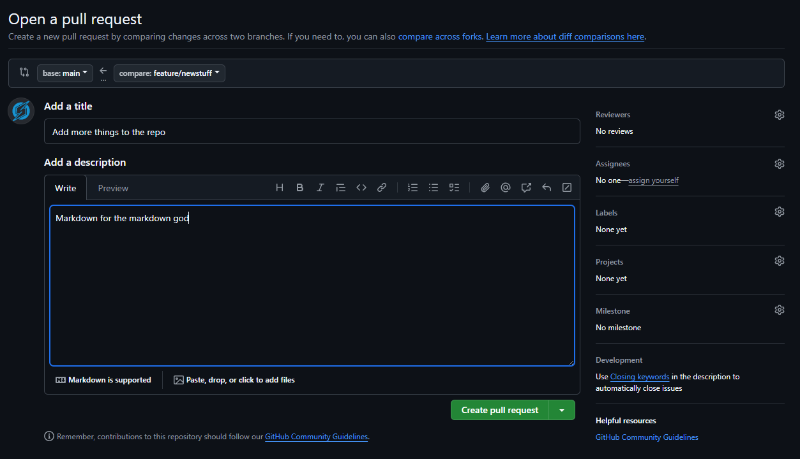

# Week 4

## PR

`git branch` shows all branches and which one you are currently working out of.   
`git branch -r` only shows branches on the remote. The feature branch is missing as I haven't pushed it yet.

###### The resulting PR:

The feature branch still exists on my machine after merging, it only gets rid of the branch on the remote. Other git providers, like GitLab give you the option to delete or not delete the branch once the merge has completed.

