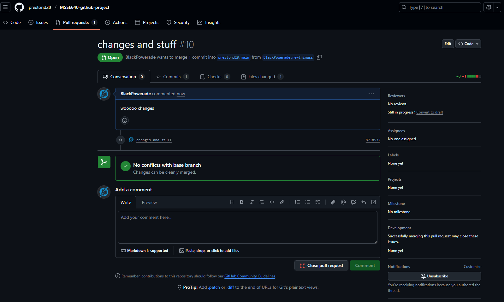

# Assignment 5: Making PR's

Fortunatly, no merge conflicts. though it seems neither of use had permissions to push branches to each other's repos, so we each made forks and opened PRs with them as the source.