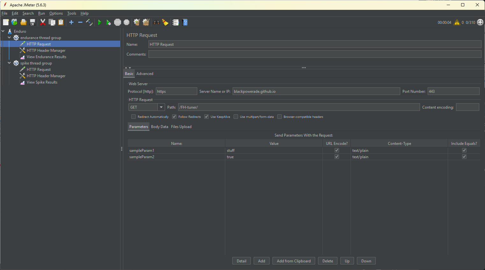
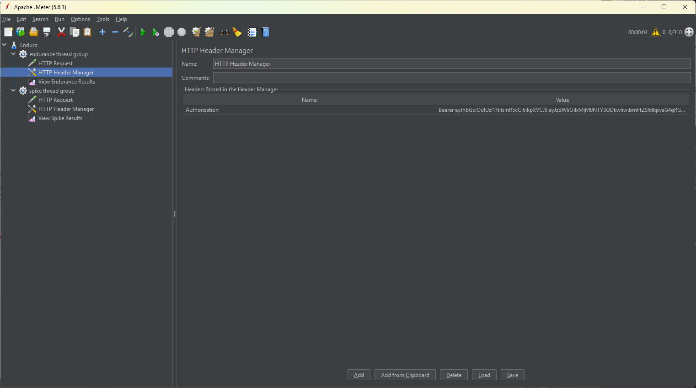
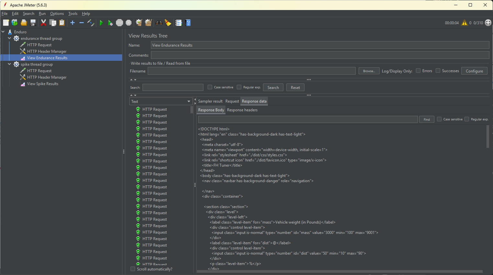
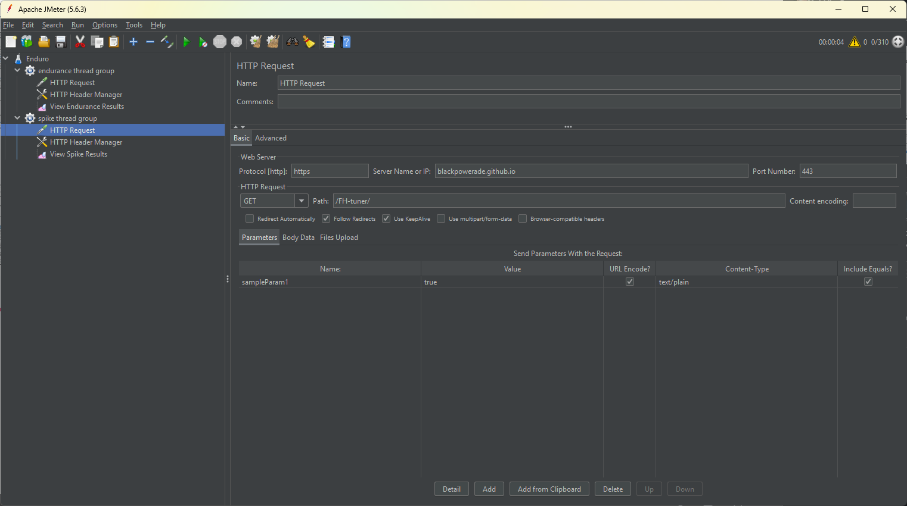
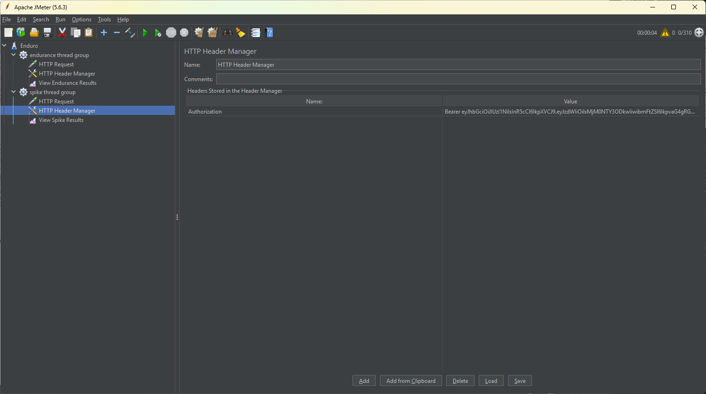
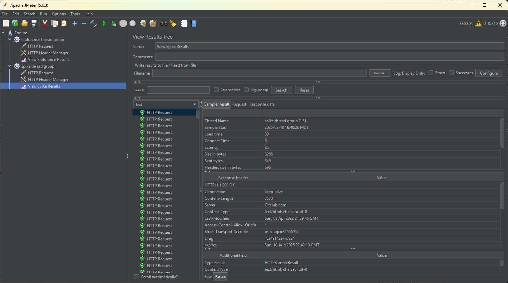

# Project Part 3 JMeter speeed

## Part 1

##### Load
Generalized request increase or workload over a period of time not necessarily pushing it the very limit, but close to it. Primarily for ensuring performance does not degrade that much during peak usage hours
```
|
|
|
|           _______________________________________
|          /                                       \
|         /                                         \___________________
|     ___/
|____/
|
|
|
|
|_________________________________________________________________________
```
##### Endurance
Normal usage. A steady stream of requests, with some flux up or down but not approaching load or idle. Not really about performance, just ensuring the server doesn't randomly decide to stop functioning.
```
|
|
|
|          
|        
|         
|           __________________
|__________/                  \___________________________________________
|
|
|
|
|__________________________________________________________________________
```
##### Spike
More requests than the server can reasonably handle, test the server to see if it crashes or not.
```
|                             |  |
|                             |  |
|                            /    \
|                           |      |
|                           |      |
|                           |      |
|                           |      |
|                           |      |
|                          /        \
|                         /          \         
|________________________/            \____________________________________
|
|
```

##### Thread Groups
Basically groups of fake users, defining how many belong to the group, how often they are going to do something and how many times they are going to do it.

##### HTTP request sampler
The details of HTTP request for the thread group to do. Protocol, address, port, parameters, method, request body, etc.


##### Config elements
Assorted extras to modify what the requests do before/after completetion/rejection, more http configuration options like headers, cookies, caching, etc.


##### Listeners
The monitoring configuration. Shows what requests did/didn't go through, their status, details about the request, how long it took for the request to complete, all the metrics your heart desires.


## Part 2
#### Endurance test


#### Spike Test


