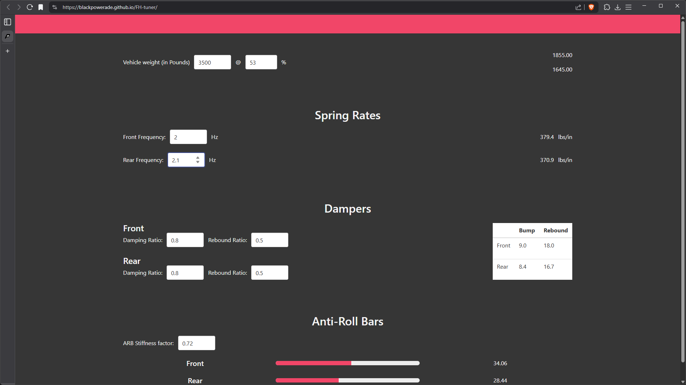
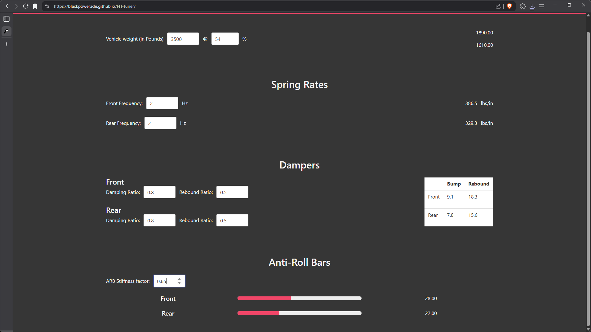

# Intro

How to do it:
1. Install selenium extension [https://chromewebstore.google.com/detail/selenium-ide/mooikfkahbdckldjjndioackbalphokd](https://chromewebstore.google.com/detail/selenium-ide/mooikfkahbdckldjjndioackbalphokd)
2. load up `./sample-test.side`
3. ???
4. Profit

# User stories

1. As a user, I want adjust my rear suspension frequency to prevent bottoming out.

2. As a user, I want to adjust my front damping settings to counteract dive on braking.

3. As a user, I want to adjust my anti-roll bar settings to achieve a lighter, more responsive steering feel.